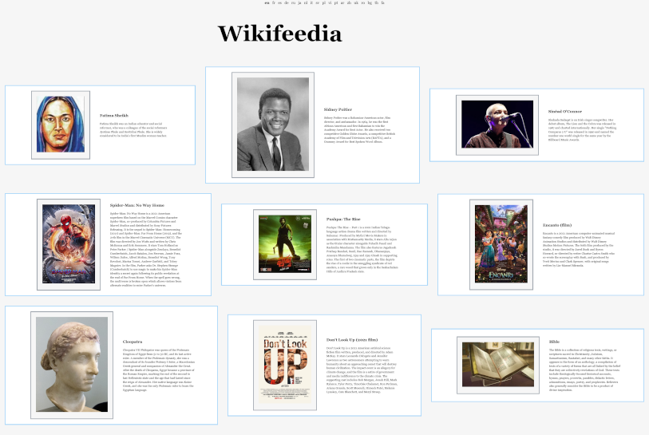

# wikifeedia

A Feed for top Wikipedia articles.

This is a sample application highlighting the benefits of using CockroachDB,
specifically [Follower Reads](https://www.cockroachlabs.com/docs/v19.1/topology-follower-reads.html#main-content).

## Architecture

The backend has two components, the [server](./server) and the [crawler](./crawler) which are both compiled into the 
same `wikifeedia` binary. These components are a simple go application. The crawler pulls the top articles list from the 
[wikipedia](./wikipedia) API and then retrieves the relevant article information and writes it to the [db](./db).

The server provides a minimal graphql schema to retrieve the articles and serves the static assets. GraphQL was chosen over a simple HTTP endpoint mostly just as a way for the author to experiment with Apollo in the client.

The backend is deployed on [k8s](./k8s) with servers running in multiple regions and a crawler run as a cron job in just one.

The web [app](./app) uses React and Apollo.

## Local Dev

```sh
# build web assets and Go binary.
`./build.sh`

# fetch top articles for the default project (en)
./wikifeedia fetch-top-articles

# start web server.
./wikifeedia --pgurl=postgresql://root@localhost:26257/wikifeedia?sslmode=disable server --port 9090

# crawl top pages for wikifeedia projects.
./wikifeedia --pgurl=postgresql://root@localhost:26257/wikifeedia?sslmode=disable crawl

# check amount of crawled articles
cockroach sql --url postgresql://root@localhost:26257/wikifeedia?sslmode=disable -e "select count(*) from articles;"
```
Screenshot (2022-01-10)

